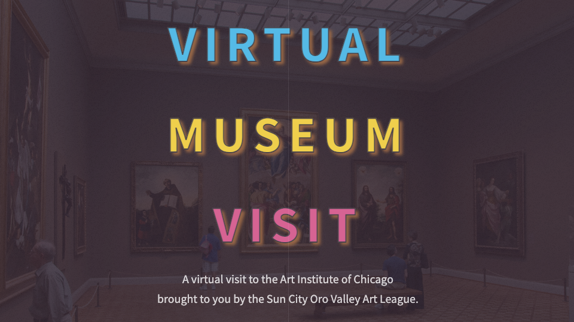

# "Virtual Museum Visit"
Web application that takes in a search term and provides artworks and related information from the Art Institute of Chicago's collection.  

**Link to project:** https://virtual-museum-visit-scov.netlify.app/

## How It's Made:

**Tech used:** HTML, CSS, JavaScript, SASS

This web app is meant to provide a virtual museum visit and secondarily to serve as an advertisement tool for a 65+ community. The app accesses two separate API's from the Art Institute of Chicago to provide images as well as relevant catalog information for each artwork. 

## Optimizations

I chose to go with a list-view for this app and I am happy with how that turned out. However, I would like to offer an alternative option for landscape view and desktops to be able to view each artwork and its related information at the same time. I would also like to add a "back" button that allows a user to return to the previous artwork they viewed as well as login functionality that would let users store a list of previously viewed artworks that they can return to.

## Lessons Learned:

Apparently there is a museum consorteum that dictates how many museums set up their API's. Due to this, the images are kept in a separate API than the rest of the catalog information. Through this project I learned new ways to fetch from multiple API's and return the data fairly seamlessly.

